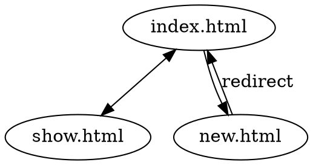

# Graphdown

Markdown extension for embedding graphs.

## Installation

```sh
$ gem install graphdown
```

## Requirements

- [Graphviz](http://www.graphviz.org/)

## Usage

```rb
require "redcarpet"
require "graphdown"

class BaseRenderer < Redcarpet::Render::HTML
  include Graphdown::Renderable
  # include other extensions
end

markdown = Redcarpet::Markdown.new(BaseRenderer, fenced_code_blocks: true)
markdown.render(content)
```

## Example

<pre>
# Views transition



- Users visit show.html from index.html.
- Users visit index.html from show.html.
- Users visit new.html from index.html.
- Users are redirected to index.html from new.html.
</pre>

Graphdown parses block codes which language is 'dot' into img tags, which load graph PNG image. The image is generated by Graphviz.
