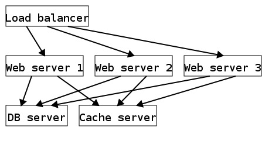
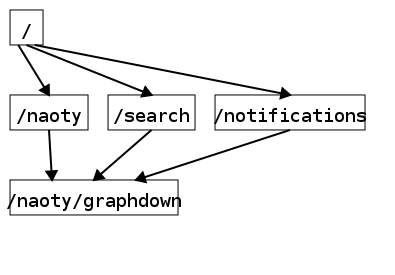

# Graphdown

Markdown extension for embedding graphs.

## Installation

```sh
$ gem install graphdown
```

## Usage

### CLI

```sh
$ graphdown sample.md
```

This command generates `sample.html`, which is parsed into HTML with graphs in format of SVG.

### Redcarpet

```rb
require "redcarpet"
require "graphdown"

class BaseRenderer < Redcarpet::Render::HTML
  include Graphdown::Renderable
end

markdown = Redcarpet::Markdown.new(BaseRenderer, fenced_code_blocks: true)
```

## Graph notation

Graphdown extends following notations for graphs.

- `[label name]`: Node named "label name"
- `[label A], [label B], ...`: Multiple nodes
- `->`: Unidirectional edge
- `<->`: Bidirectional edge

Graphdown parses these notations into graph images in SVG format.

### Examples

<pre>
# Servers arrangement

[Load balancer] -> [Web server 1], [Web server 2], [Web server 3] -> [DB server], [Cache server]
</pre>



<pre>
# Path to naoty/graphdown on GitHub

[/] -> [/naoty] -> [/naoty/graphdown]
[/] -> [/search] -> [/naoty/graphdown]
[/] -> [/notifications] -> [/naoty/graphdown]
</pre>



## References

- Kazuo Misue, Kouzou Sugiyama, On Automatic Drowing of Compound Graphs for Computer Aided Diagrammatical Thinking, Journal of Information Processing Society of Japan, 1989, Vol.30, No.10, p1324-1334.
