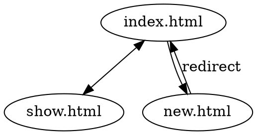

# Views transition

```dot
digraph sample {
    A [label = "index.html"];
    B [label = "show.html"];
    C [label = "new.html"];

    A -> B [dir = both];
    A -> C;
    C -> A [label = "redirect"];
}
```

- Users visit show.html from index.html.
- Users visit index.html from show.html.
- Users visit new.html from index.html.
- Users are redirected to index.html from new.html.
